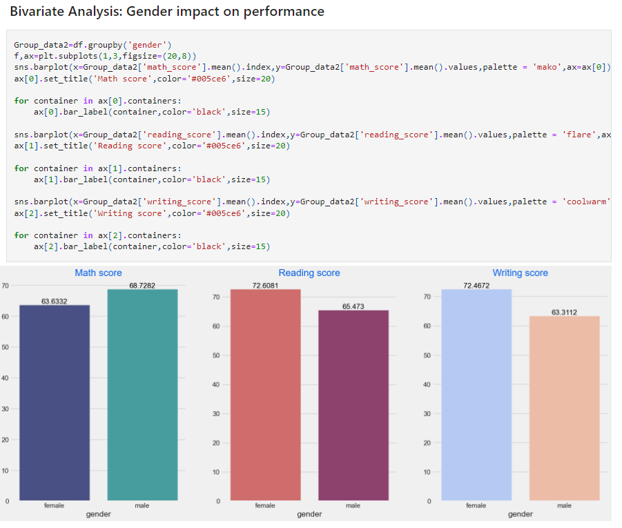
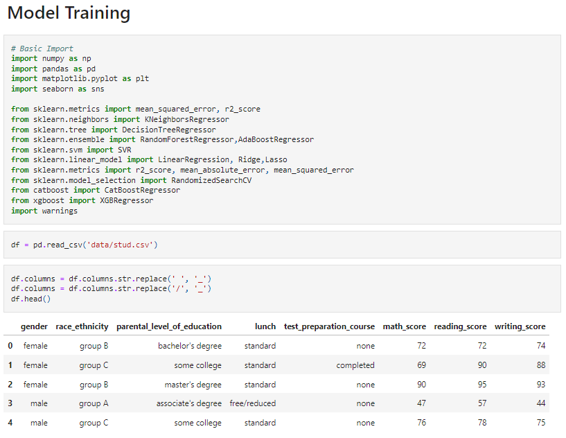
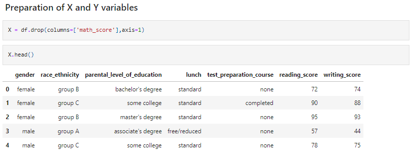
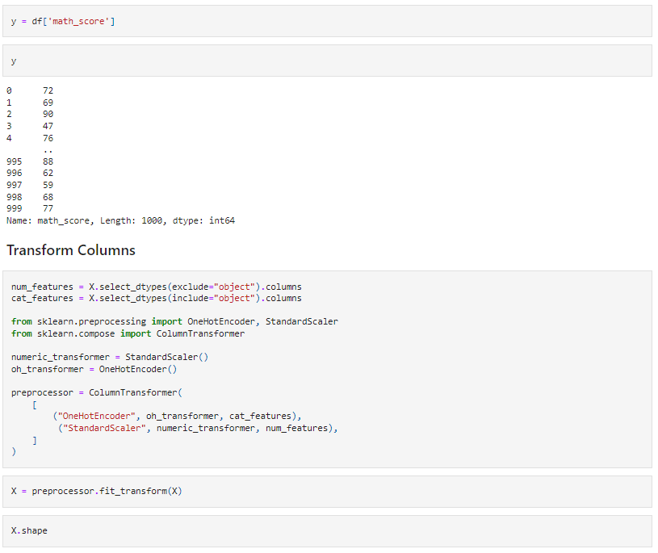
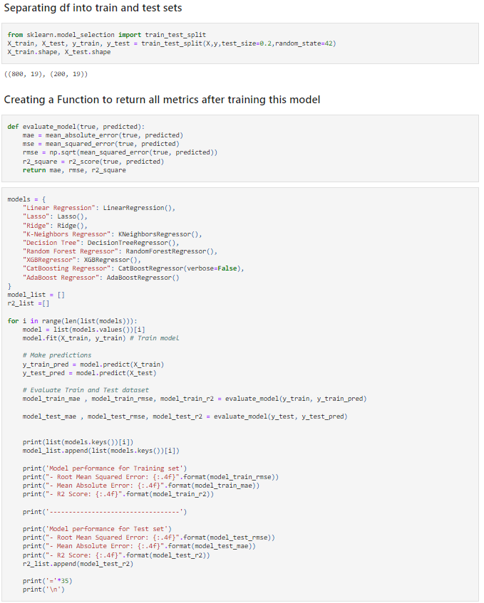
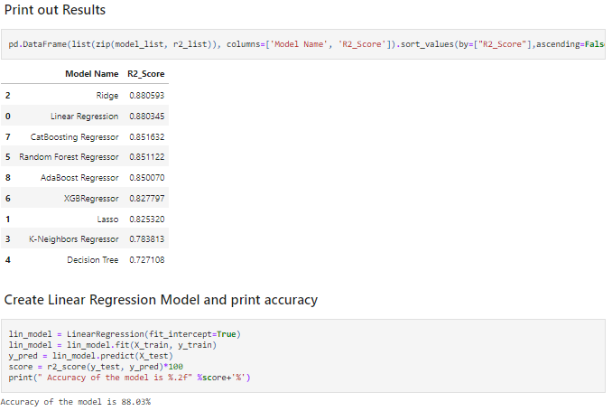
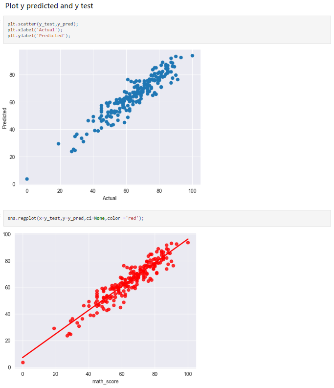

# Project: Student Performance Indicators
### Background:
This project analyzes how student performance is affected by variables such as Gender, Ethnicity, Parental Education, and test preparation. I then created a Machine
Learning model to predict a student's overall math score based on the variables above. 
### Methods Used
* Inferential Statistics
* Machine Learning
* Data Visualization
* Predictive Modeling
* Exploratory Data Analysis (EDA)

### Technologies Used
* Python
* Pycharm
* Git
* Pandas
* Matplotlib
* Seaborn
* plotly 
* scikit-learn 
* xgboost 
* catboost

### Data Source
* Kaggle - https://www.kaggle.com/datasets/spscientist/students-performance-in-exams?datasetId=74977

## Exploratory Data Analysis in Jupyter
EDA_STUDENT_PERFORMANCE.ipynb

## Model Training
link 
#### Training a machine learning model to predict a student's math score based on:
  - Gender
  - Ethnicity	
  - Parents' Level of Education
  - Student Participation in a Discounted Lunch Program
  - Test Preparation Course Attendance
  - Reading Scores 
  - Writing Scores

