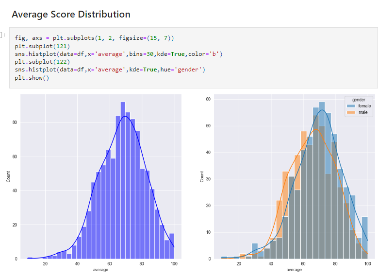

# Project: Student Performance Indicators
### Background:
This project analyzes how student performance is affected by variables such as Gender, Ethnicity, Parental Education, and test preparation.  
### Methods Used
* Inferential Statistics
* Machine Learning
* Data Visualization
* Predictive Modeling
* Exploratory Data Analysis (EDA)

### Technologies Used
* Python
* Pycharm
* Git
* Pandas
* Matplotlib
* Seaborn
* plotly 
* scikit-learn 
* xgboost 
* catboost

### Data Source
* Kaggle - https://www.kaggle.com/datasets/spscientist/students-performance-in-exams?datasetId=74977

## Exploratory Data Analysis in Jupyter
EDA_STUDENT_PERFORMANCE.ipynb
